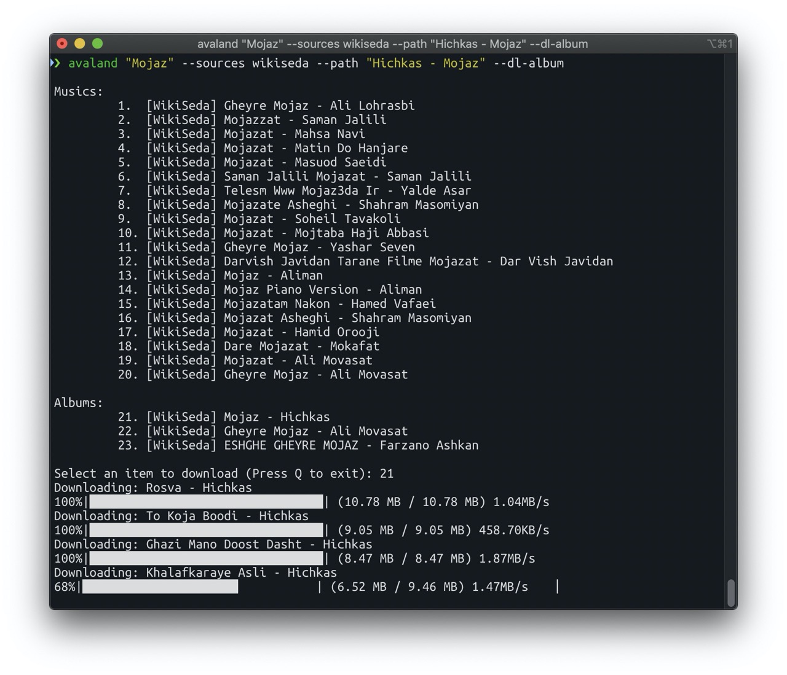

[](https://badge.fury.io/py/avaland) 
[](https://travis-ci.org/dragon-born/avaland)
<p style="text-align: center">
     <h2 style="text-align: center">Avaland Music Downloader</h2>
     <p style="text-align: center">Avaland is a command-line program to download musics directly from most popular Iranian music websites, written in Python. It supports RadioJavan, Bia2Music, Nex1Music, Navahang, WikiSeda and RapFarsi.</p>

>It requires the Python interpreter, version 3.5+, and it is not platform specific. It should work on your Unix box, on Windows or on macOS.


## Installation and Notes
To install it open your terminal and type:
```
pip3 install avaland
```

## Usages And Examples

The usages can be found with the -h or --help flag:
```
Usage: [-h] [--path PATH] [--sources SOURCES] [--dl-first]
               [--dl-album] [--dl-artist]
               query
positional arguments:
  query                 Search query

optional arguments:
  -h, --help            show help message and exit
  --path PATH, -p PATH  path to download music/album
  --sources SOURCES, -s SOURCES
                        list of sources (default: --sources all) Available
                        sources: Bia2, Navahang, Nex1, RadioJavan, RapFarsi,
                        WikiSeda
  --dl-first, -df       download first music in list
  --dl-album, -da       download all musics in an album
  --dl-artist, -dr      download all musics of an artist
```

```commandline
# Search tracks
avaland "your search query"

# Search and download first result
avaland "your search query" --dl-first

# Search with custom sources
avaland "your search query" --sources radiojavan,bia2,rapfarsi

# Set custom download path directory
avaland "your search query" --path /foo/bar
```

## Getting Started (For Developers)

```python
from avaland.manager import SourceManager
from avaland.sources import *

manager = SourceManager()

#  register two sources
manager.register(Bia2)
manager.register(RapFarsi)

if __name__ == '__main__':
    #  search for a query
    search = manager.search("hello adele")
    print(search)
    #  download first result from bia2
    download = search['bia2'].musics[0].download()
    print(download)
```
## Contributing

Contributions are what make the open source community such an amazing place to be learn, inspire, and create. Any contributions you make are greatly appreciated.
1. Fork it (<https://github.com/dragon-born/avaland>)
2. Create your Feature Branch (`git checkout -b feature/newfeature`)
3. Commit your changes (`git commit -am 'Add some amazing new feature'`)
4. Push to the branch (`git push origin feature/newfeature`)
5. Open a new Pull Request


# License

[MIT](LICENCE)
